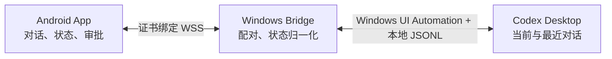

# Codex Micro Desktop Sync V2.0.3

Codex Micro 是一套 Android 与 Windows 的局域网桌面同步控制器：手机通过证书绑定的 WSS 连接 Windows Bridge，向当前可操作的 Codex Desktop 对话发送文本、查看独立回复，并在手机端确认桌面权限请求。

本仓库为公开源码仓库。当前稳定版本是 **v1.0.6**；`main` 包含 **v2.0.3 发布候选源码**。V2.0.3 是 Windows Bridge 热修复，Android 继续使用 V2.0.0。协议与 Windows 自动门禁已经通过，但真实 Windows、Codex Desktop、Android 手机与局域网联合验收尚未完成，因此目前没有正式 `v2.0.3` 标签或 Release，也不会取代 v1.0.6 的 Latest 状态。

V2.0.3 过滤 Codex 回复后临时出现的“查看活动/需要关注”等动态标题栏文案。标题短暂无法唯一识别时，Bridge 保留上一次确认的会话以继续同步，但暂停手机发送，直到桌面标题重新确认，避免消息误发到其他对话。



## V2.0.3 核心能力

- 当前可操作桌面对话固定在槽位 1；后台活动不会抢占当前卡片。
- 当前对话与最近五个对话按稳定会话 ID 独立保存回复、状态与审批，不混用内容；这六个会话是本版手机同步范围，不承诺永久保留范围外的全部桌面历史。
- 运行、完成、终止状态以本地 Codex JSONL 生命周期事件为准；完成后的未读卡片显示绿色状态。
- Goal、计划和提问卡片缺少普通输入框时，网络和会话同步仍保持可用；仅发送入口临时不可用。
- 回复结束后动态标题短暂替换对话标题时保留已确认会话，继续同步状态与回复，同时锁定发送入口。
- 旧数据库保留任务超过六条时稳定选取当前、已分配及最近会话，不删除范围外的电脑本地历史。
- 手机审批显示简短的操作与目标摘要，仍需长按 0.6 秒批准，并在执行前重新核对桌面审批指纹。
- 已移除演示模式及演示数据；Android 采用通用 Release APK、R8 混淆和资源压缩。
- 白色 Material 3 界面用卡片底色、图标和文字共同表达状态。

## 安全与边界

- 手机与电脑应处于同一可信局域网；不需要 VPN，也不提供云中继。
- 二维码配对包含 WSS 地址、SPKI 指纹、一次性 nonce 和配对码，不包含 OpenAI/Codex 凭据。
- Bridge 只向经过复核的 Codex Desktop 窗口写入文本或点击审批；窗口、输入框或审批控件变化时会拒绝执行。
- 本版本不提供 BLE、语音、iOS/macOS、完整终端或 diff 控制。

## 目录

| 目录 | 内容 |
| --- | --- |
| `android/` | Kotlin、Jetpack Compose Android 客户端 |
| `bridge/` | .NET 10 Windows Bridge 与桌面 UI Automation |
| `shared/` | WSS 协议和验证 fixture |
| `docs/` | 架构、测试策略和发布说明 |
| `design-system/` | 设计参考；Android 运行时主题仍以客户端源码为唯一权威实现 |
| `scripts/` | 协议生成与统一验证脚本 |
| `archive/` | 无精确源码快照版本的历史二进制证据与校验值，不包含二进制 |

本地 `release/`、APK、Windows ZIP、EXE、构建缓存、证书和配对数据均被排除在 Git 历史之外。正式二进制只上传对应 GitHub Release。

## 构建与验证

```powershell
node .\shared\protocol-v1\validate-fixtures.mjs
dotnet test bridge\CodexMicroBridge.sln -c Release
android\gradlew.bat -p android --no-daemon `
    testDebugUnitTest assembleRelease lintRelease assembleDebugAndroidTest
```

Windows 端需要 .NET 10 SDK；Android 端需要让 `JAVA_HOME` 指向 JDK 17，并配置 Android SDK 36 与 Build Tools 36.0.0。Gradle Wrapper 会按锁定的 8.11.1 版本和 SHA-256 下载构建工具。

自动化测试验证协议、会话归属、生命周期、审批绑定与 Android 本地数据迁移。真实 Codex Desktop、真实手机、局域网、后台保活及权限确认仍须做联机验收，详见 [docs/testing.md](docs/testing.md) 与 [V2.0.3 发布说明](docs/v2.0.3-release-notes.md)。

当前 V2.0.3 自动证据为：Shared protocol 38 cases / 1 pair、Windows Bridge 112/112。Android 本次未改源码，继续沿用 V2.0.0 的 `versionName 2.0.0`、`versionCode 18` 和原签名 APK；这不等于 V2.0.3 已通过真实手机、Codex Desktop 与局域网联合验收。

## Android 兼容与发布身份

- applicationId：`com.codexmicro.mobile.debug`
- V2.0.0：`versionName 2.0.0`，`versionCode 18`
- v1.0.1 及以后版本必须保持既有 APK 签名连续性，才能覆盖安装并保留配对与真实历史。
- 签名证书 SHA-256：`B952979D47D4437B7BF694AB52B9F9165331EAD74EAF9A780E7B32F550FE7D9C`
- keystore、密码和私钥绝不能进入仓库或 Release。

## 版本与源码边界

| 版本 | 状态 | 源码边界 |
| --- | --- | --- |
| v1.0.6 | 当前 Latest；V1.x 单对话基础链路已实机验证，多对话可能混流 | 完整源码标签 |
| v1.1.0 | 多对话隔离候选，联合实机未完成 | 历史候选二进制归档，不声明包含完整源码 |
| v1.1.1 | Goal/计划热修复候选；后来仍有降级、抢占和状态串线 | 历史候选二进制归档，不声明包含完整源码 |
| v2.0.0 | 多会话完整源码候选；真实联合验收未形成正式发布结论 | 历史完整源码提交，无正式 tag/Release |
| v2.0.1 | 六会话快照容量热修复候选；已被后续版本包含 | 历史候选二进制归档，不声明包含完整源码 |
| v2.0.2 | 新版标题栏兼容候选；回复后可能误降级，已被 V2.0.3 取代 | Superseded 历史候选二进制归档，不声明包含完整源码 |
| v2.0.3 | 当前 Windows 热修复候选；自动门禁通过，真实联合验收待完成 | `main` 完整候选源码，无正式 tag/Release |

更早版本、失败记录和各标签边界见 [CHANGELOG.md](CHANGELOG.md)、[`docs/releases/`](docs/releases/) 与 [`archive/`](archive/)。禁止用当前源码改版本号伪造旧版本，禁止移动已发布标签或 force push。
