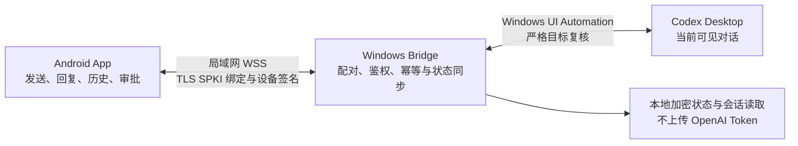

# Codex Micro Mobile Bridge

Codex Micro 是一套 Android + Windows 局域网桌面同步控制器。手机通过证书绑定的 WSS 安全连接 Windows Bridge，控制电脑屏幕上当前打开的 Codex Desktop 对话：发送消息、接收完整回复、查看历史、观察运行状态，并在 Codex 出现权限请求时执行一次批准或拒绝。

OpenAI/Codex 登录、Token 和本地会话文件始终留在电脑端，不会发送到手机。本仓库为私有项目，当前正式版本为 **v1.0.1**。

## 工作方式



手机不直接调用 OpenAI API，也不接管任意后台任务。Windows Bridge 只对当前可见、未最小化且能够重新核验的 Codex Desktop 对话执行操作；目标或控件发生变化时会拒绝操作。

## 主要能力

- 手机消息写入电脑当前 Codex 输入框，并在再次核验窗口、焦点和输入内容后点击发送。
- 同步运行、完成未读、待审批、错误和离线状态。
- 完整展示长回复，并将“最近回复”与完整历史对话分离。
- Wi-Fi 短暂断开后自动恢复；每一轮重连计数重新从第 1 次开始。
- 支持小米/红米设备的前台服务、后台与锁屏持续连接模式。
- 识别真实 Computer Use 审批；普通批准只映射“允许此对话”，不会选择“始终允许”。
- 二维码或手动配对、P-256 设备密钥、TLS SPKI 指纹绑定和逐连接挑战。
- Android 与 Windows 之间的写操作幂等，以及 epoch/seq 断线重同步。
- Windows EXE、主窗口和托盘使用统一应用图标。

## 使用边界

- 手机和电脑应位于同一可信局域网；不需要手机 VPN。
- v1.0.1 不提供云中继、BLE、iOS/macOS、语音、完整终端或完整 diff。
- 仅控制当前可见、未最小化且可核验的 Codex Desktop 对话。
- Codex Desktop 更新控件结构后，Windows UI Automation 适配可能需要同步更新。
- 真实审批测试必须把 Codex 设置为“请求批准”，不能使用“替我审批”。
- 手机普通批准只对应“允许此对话”，不会静默扩大为“始终允许”。
- 后台连接仍受小米/红米的自启动、电池策略和后台锁定设置影响。

## 快速开始

1. 从对应 GitHub Release 下载 Android APK、Windows ZIP 和 `SHA256SUMS.txt`，先校验 SHA-256。
2. 解压 Windows ZIP，保持文件夹内全部文件在一起，先启动并登录 Codex Desktop。
3. 打开需要控制的 Codex 对话，启动 `CodexMicroBridge.exe`，等待“桌面同步可用”。
4. 手机与电脑连接同一个可信 Wi-Fi，在 Bridge 中打开 60 秒配对窗口。
5. Android App 扫描二维码，或手动输入地址、SPKI 指纹和配对码。
6. 手机显示绿色连接后，从“当前桌面对话”发送消息。
7. 出现权限请求时，在手机“确认”页核对详情，长按约 0.6 秒批准，或直接拒绝。

PowerShell 校验示例：

```powershell
Get-FileHash .\CodexMicroMobile-v1.0.1.apk -Algorithm SHA256
Get-FileHash .\CodexMicroBridge-v1.0.1-zhCN-win-x64-desktop-sync.zip -Algorithm SHA256
```

### v1.0.0 升级注意事项

v1.0.0 与 v1.0.1 APK 的签名证书不同，Android 会拒绝直接覆盖安装。从 v1.0.0 升级时，需要先卸载旧 App，再安装 v1.0.1，并重新配对；卸载会清除手机端本地配对和历史数据。从 v1.0.2 起，发布门禁要求保持与 v1.0.1 相同的包名与签名密钥，并递增 `versionCode`。

## 目录结构

| 路径 | 内容 |
| --- | --- |
| `android/` | Kotlin、Jetpack Compose、Material 3 Android 客户端 |
| `bridge/` | .NET 10 WPF Windows Bridge、UI Automation 适配和测试 |
| `shared/protocol-v1/` | Android 与 Bridge 共用协议、Schema 和 fixtures |
| `shared/app-server-*` | 早期 App Server 兼容研究与固定 Schema；不是 v1.0.1 运行时链路 |
| `design-system/` | UI 设计规范 |
| `docs/` | 架构、安全、测试、版本演进和发布文档 |
| `scripts/` | 协议生成与统一验证脚本 |
| `archive/v1.0.0/` | v1.0.0 历史二进制归档说明与校验值，不包含二进制 |

## 构建与验证

环境要求：

- Node.js，用于共享协议 fixture 验证
- .NET SDK 10，用于 Windows Bridge
- JDK 17、Android SDK 36 和 Build Tools 36.0.0，用于 Android

统一验证：

```powershell
.\scripts\verify.ps1
```

分层执行：

```powershell
node .\shared\protocol-v1\validate-fixtures.mjs
dotnet test .\bridge\CodexMicroBridge.sln -c Release

$env:JAVA_HOME = '<JDK 17 路径>'
$env:ANDROID_SDK_ROOT = '<Android SDK 路径>'
.\android\gradlew.bat -p .\android --no-daemon testDebugUnitTest assembleDebug
```

自动测试不等于实机验收。真实 Codex Desktop 输入、Computer Use 批准/拒绝、CameraX、通知、Doze 和不同 Windows/Android 版本仍需电脑与手机联合验证。

## 版本历史

### v1.0.1

当前完整源码版本。修复真实 Computer Use 审批识别，限制普通批准只选择“允许此对话”，加入完整对话历史、回复展示去重和 Windows 统一图标。详见 [v1.0.1 更新说明](./docs/v1.0.1-release-notes.md)。

### v1.0.0

首个通过实机验收的正式版本。仓库建立时没有找到可独立验证的精确源码快照，因此 `v1.0.0` 标签是根据已验收二进制和发布说明建立的历史归档，不声明包含完整 v1.0.0 源码。详见 [v1.0.0 归档说明](./archive/v1.0.0/README.md)和 [v1.0.0 发布说明](./docs/v1.0.0-release-notes.md)。

开发测试阶段的完整演进见 [开发测试版本演进记录](./docs/Codex-Micro-开发测试版本演进记录.md)，正式变更见 [CHANGELOG](./CHANGELOG.md)。

## 后续发布规则

每个新版本都在独立分支完成版本号、代码、测试和文档更新。只有用户完成手机与电脑实机验收并明确确认发布后，才合并到 `main`、创建不可移动的 annotated tag 和正式 GitHub Release。每个 Release 包含：

- `CodexMicroMobile-vX.Y.Z.apk`
- `CodexMicroBridge-vX.Y.Z-zhCN-win-x64-desktop-sync.zip`
- `SHA256SUMS.txt`
- 对应版本更新说明

完整流程和签名连续性门禁见 [发布流程](./docs/releasing.md)。

## 安全与许可

安全边界和敏感信息处理见 [SECURITY.md](./SECURITY.md)及 [安全设计](./docs/security.md)。仓库不会提交 Token、私钥、Android keystore、配对数据库、证书、日志、本机路径白名单或构建缓存。

本私有仓库当前未授予公共开源许可证；未经所有者明确许可，不得公开分发源码或二进制。
