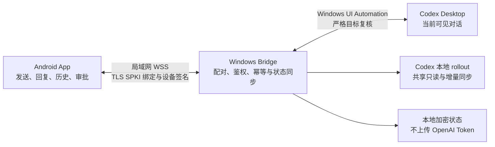

# Codex Micro Desktop Sync

Codex Micro 是一套 Android + Windows 局域网桌面同步控制器。Android 手机通过证书绑定的 WSS 安全连接 Windows Bridge，控制电脑上当前打开的 Codex Desktop 对话：发送消息、接收电脑与手机两端的完整对话、查看历史和未读状态，并在 Codex 出现权限请求时执行一次批准或拒绝。

OpenAI/Codex 登录、Token 和本地会话文件始终留在 Windows 电脑端，不会发送到手机。本仓库为私有项目；当前稳定版本为 **v1.0.6**。该版本已完成自动验证和 Windows + 红米 K80 Pro 关键联合实机验收，是 V1.x 已验证的单对话基础链路。

> 版本提醒：`v1.0.5` 存在消息同步链完全失效的严重回归，不建议安装。`v1.0.0` 是已完成核心实机验收的基础版本；`v1.0.2–v1.0.5` 仅作为历史证据保留。

## 工作方式



手机不直接调用 OpenAI API，也不接管任意后台任务。Windows Bridge 只对当前可见、未最小化且能够重新核验的 Codex Desktop 对话执行操作；目标、焦点或控件发生变化时会拒绝操作。

## 主要能力

- 将手机消息写入当前 Codex 输入框，重新核验窗口、焦点和输入内容后点击发送，并确认输入框已清空。
- 从当前 root rollout 会话同步电脑和手机发出的 canonical 用户消息与助手回复，使用消息 ID 幂等去重。
- 对 Codex 正在追加写入的活动会话文件采用 `FileShare.ReadWrite | FileShare.Delete` 安全只读访问。
- 同步运行、空闲、完成未读、待审批、降级、错误和离线状态。
- 完整展示长回复，将“最近回复”与可恢复的完整历史对话分离。
- Wi-Fi 短暂断开后自动恢复，支持小米/红米设备的前台服务、后台和锁屏持续连接模式。
- 识别真实 Computer Use 审批；普通批准只映射“允许此对话”，不会选择“始终允许”。
- 二维码或手动配对、P-256 设备密钥、TLS SPKI 指纹绑定和逐连接挑战。
- Android 与 Windows 写操作幂等，以及 epoch/seq 断线重同步。

## 安全与使用边界

- 手机和电脑应位于同一可信局域网；不需要手机 VPN。
- 当前不提供云中继、BLE、iOS/macOS、语音、完整终端或完整 diff。
- 仅控制当前可见、未最小化且可核验的 Codex Desktop 对话。
- Codex Desktop 更新控件结构后，Windows UI Automation 适配可能需要同步更新。
- 真实审批测试必须把 Codex 设置为“请求批准”，不能使用“替我审批”。
- 手机普通批准只对应当前审批的“允许此对话”，不会静默扩大为“始终允许”。
- 后台连接仍受小米/红米的自启动、电池策略和后台锁定设置影响。
- 自动测试、构建成功和静态扫描都不能替代真实 Windows + Android 联合验收。

详细边界见 [SECURITY.md](./SECURITY.md)和 [安全设计](./docs/security.md)。

## 下载与使用

1. 从对应 GitHub Release 下载 Android APK、Windows ZIP 和 `SHA256SUMS.txt`。
2. 使用 SHA-256 校验两个二进制；不要安装哈希不一致的文件。
3. 解压 Windows ZIP，保持文件夹内全部运行时文件在一起。
4. 启动并登录官方 Codex Desktop，打开需要控制的对话。
5. 启动 `CodexMicroBridge.exe`，等待“桌面同步可用”。
6. 手机与电脑连接同一个可信 Wi-Fi，在 Bridge 中打开 60 秒配对窗口。
7. Android App 扫描二维码，或手动输入地址、SPKI 指纹和配对码。
8. 手机显示绿色连接后，从“当前桌面对话”发送消息；出现权限请求时核对详情并长按批准，或直接拒绝。

PowerShell 校验示例：

```powershell
Get-FileHash .\CodexMicroMobile-vX.Y.Z.apk -Algorithm SHA256
Get-FileHash .\CodexMicroBridge-vX.Y.Z-zhCN-win-x64-desktop-sync.zip -Algorithm SHA256
```

### Android 覆盖安装与签名连续性

- 所有历史 APK 的包名均为 `com.codexmicro.mobile.debug`。
- `v1.0.0` 与 `v1.0.1` 的签名证书不同，Android 会拒绝直接覆盖安装；升级时必须先卸载 v1.0.0，再安装新版本并重新配对。
- `v1.0.1–v1.0.6` 使用同一签名，能够逐版覆盖安装并保留配对和历史数据。
- 签名证书 SHA-256 指纹可公开用于校验；keystore 文件和密码永远不能进入仓库或 Release。

## 目录结构

| 路径 | 内容 |
| --- | --- |
| `android/` | Kotlin、Jetpack Compose、Material 3 Android 客户端与测试 |
| `bridge/` | .NET 10 WPF Windows Bridge、UI Automation、会话同步和测试 |
| `shared/protocol-v1/` | Android 与 Bridge 共用协议、Schema 和 fixtures |
| `shared/app-server-*` | App Server 兼容研究与固定 Schema；不是当前桌面同步运行链路 |
| `design-system/` | UI 设计规范 |
| `docs/` | 架构、安全、测试、版本演进和发布文档 |
| `scripts/` | 协议生成与统一验证脚本 |
| `archive/` | 无精确源码快照版本的历史二进制证据说明与校验值；不存放二进制 |

## 构建与验证

先决条件：

- Windows 10/11 x64
- 正在运行并已登录的官方 Codex Desktop
- Node.js
- .NET 10 SDK
- JDK 17
- Android SDK 36 与 Build Tools 36.0.0

在普通 ASCII 路径的干净仓库中执行：

```powershell
node .\shared\protocol-v1\validate-fixtures.mjs
dotnet test .\bridge\CodexMicroBridge.sln -c Release

$env:JAVA_HOME = '<JDK 17 路径>'
$env:ANDROID_SDK_ROOT = '<Android SDK 路径>'
.\android\gradlew.bat -p .\android --no-daemon testDebugUnitTest assembleDebug
```

v1.0.6 当前自动验证基线：

| 验证层 | 结果 |
| --- | --- |
| Shared protocol | 38 cases / 1 pair |
| Windows Bridge | 81 passed，0 failed |
| Android JVM | 29 passed，0 failed |
| APK | `com.codexmicro.mobile.debug`，versionCode 15，versionName 1.0.6 |
| Windows EXE | 文件版本 1.0.6.0 |

## 版本历史与源码边界

| 版本 | 状态 | 源码/归档边界 |
| --- | --- | --- |
| v1.0.0 | 核心实机验收通过的基础版本 | 历史二进制归档标签，不声明包含完整源码 |
| v1.0.1 | 历史版本；真实同步仍不稳定 | 在工作区继续演进前已导入并发布的源码标签；与 v1.0.0 签名不连续 |
| v1.0.2 | 实机新回复同步和审批状态恢复失败 | 历史二进制归档标签，不声明包含完整源码 |
| v1.0.3 | 手机发送和一次真实 Computer Use 审批通过；电脑主动消息仍延迟 | 历史二进制归档标签，不声明包含完整源码 |
| v1.0.4 | 固定落后一轮，状态可能不一致 | 历史二进制归档标签，不声明包含完整源码 |
| v1.0.5 | **严重同步回归，不建议使用** | 历史二进制归档标签，不声明包含完整源码 |
| v1.0.6 | 已验证的 V1.x 单对话基础链路；多桌面对话可能混流 | 完整源码标签 |

逐版变化和已知问题见 [CHANGELOG.md](./CHANGELOG.md)与 [`docs/releases/`](./docs/releases/)。历史归档说明见 [`archive/`](./archive/)。

## v1.0.6 实机验收结论

用户已在真实 Windows、Codex Desktop 与红米 K80 Pro 环境确认：

1. 手机发送消息后，本轮 Codex 回复能够及时到达，无需再发送第二条触发同步。
2. 电脑直接输入消息后，手机能够实时收到消息和回复。
3. 真实 Computer Use 请求可在手机显示；批准后只执行一次、显示“已批准”并退出“待审批”，拒绝分支正常。
4. Wi-Fi 重连计数、后台保活、锁屏恢复和长回复末尾显示均完成过测试。

已知限制：v1.0.6 仍按单一当前桌面对话组织手机端状态。多个 root 对话同时活动时，消息、状态或审批可能混入同一手机对话；该版本不提供可靠的多会话隔离。

## 后续版本发布规则

每个新版本使用新的 `versionName`、递增的 Android `versionCode` 和对应 Windows 文件版本。先完成代码、自动测试、产物校验和文档更新，再由用户完成电脑与手机实机验收；用户明确确认后，才创建一次不可移动的 annotated tag 和正式 GitHub Release。每个 Release 固定包含：

- `CodexMicroMobile-vX.Y.Z.apk`
- `CodexMicroBridge-vX.Y.Z-zhCN-win-x64-desktop-sync.zip`
- `SHA256SUMS.txt`
- 对应版本更新说明

完整流程见 [发布流程](./docs/releasing.md)。禁止为了补历史而用当前源码伪造旧版本，禁止重写已发布标签或 force push。

## 许可

本私有仓库当前未授予公共开源许可证；未经所有者明确许可，不得公开分发源码或二进制。
