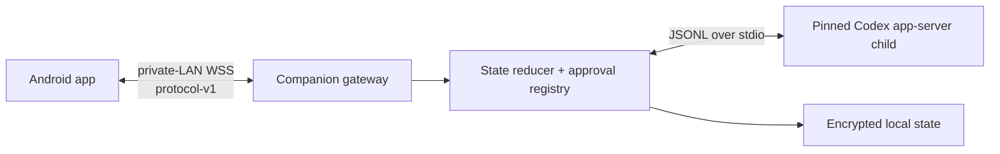

# Codex Micro Mobile architecture

## Decision summary

V1 is a two-process desktop companion plus an Android client:



The companion is the only Codex client. It starts a pinned `codex app-server`
child with the default stdio transport, performs the app-server initialization
handshake, owns the threads it creates or resumes, and translates app-server
events into [protocol-v1](../shared/protocol-v1/README.md). Android never talks
to app-server directly.

## Hard ownership boundary

- A V1 task is a thread created or resumed by this companion's app-server
  session and registered in one of six slots.
- The companion cannot attach to, steer, interrupt, or approve a task merely
  because it is visible in ChatGPT Desktop. ChatGPT Desktop and this companion
  are separate app-server clients/processes.
- Reading local ChatGPT/Codex files may be used only for an explicitly labelled
  read-only migration/import flow. It never grants control authority and is not
  a V1 live-state source.
- Official Remote and reverse-engineered Codex Micro HID are outside this
  architecture.

This boundary is user-visible: the UI says "Companion tasks," never implies it
is remotely controlling an independently running ChatGPT Desktop task, and
does not merge the two task lists.

## Components

### Android

- Pairs with the desktop QR nonce plus 60-second six-digit code, pins the
  companion SHA-256 SPKI identity, and signs challenges with a non-exportable
  Android Keystore P-256 key.
- Maintains one authenticated WSS connection, treats its first business frame
  as an authoritative `snapshot`, and applies later `epoch`/`seq` events in
  order. A gap forces reconnect and another snapshot.
- Renders six task slots, the four normalized approval/input types, text input, and
  task commands. Voice and push-to-talk are outside V1.
- Treats an accepted write as pending until authoritative lifecycle events
  arrive.

### Companion gateway

- Binds only to selected private interfaces and exposes WSS, not the
  app-server child.
- Authenticates the WebSocket upgrade and validates every protocol-v1 message.
  Pair/auth rate limiting remains an explicit production release gate until its
  implementation and abuse tests are present.
- Owns epochs, ordered events, `clientCommandId` idempotency, the six-slot
  mapping, pending-approval bindings, and snapshot creation.
- Stores the TLS private key/recovery state for the current OS user, registered
  Android public keys, idempotency records, and slot assignments.

### App-server supervisor and adapter

- Requires the exact pinned Codex CLI version and matching generated schema lock
  before launching it as a child process.
- Uses stdin/stdout as newline-delimited JSON only. The child's stderr is a
  diagnostic stream and is never parsed as protocol data.
- Initializes once, creates/resumes only companion-owned threads, forwards the
  nine supported operations, and reduces notifications into nine public event
  types.
- Converts exactly four server-request families into `approval.requested`
  events and maps `approval.respond` back to their type-specific responses.
- Fails closed when the runtime CLI/schema differs from the build lock.

## Public business protocol

Pairing and connection challenge frames are transport extensions on the same
`/v1/mobile` WSS. Once authenticated, Android and the companion exchange only
these canonical forms:

```text
request:  {v:1, id, op, params}
response: {v:1, id, result} or {v:1, id, error}
event:    {v:1, epoch, seq, event, data}
```

The only V1 operations are `tasks.list`, `task.create`, `task.read`,
`task.send`, `task.interrupt`, `task.fork`, `task.read_ack`,
`approval.respond`, and `slot.assign`. The only V1 events are `snapshot`,
`bridge.status`, `task.state`, `task.message.delta`,
`task.message.completed`, `task.plan.updated`, `approval.requested`,
`approval.resolved`, and `task.error`.

All seven writes carry a stable `clientCommandId` and current `epoch`.
`task.create` selects a desktop-configured `projectId`; Android never submits a
filesystem path. `snapshot`/`tasks.list` provide a `projectCatalog` with
`projectId` and display name; a path, if exposed, is read-only companion
metadata and is never accepted back as `cwd`.

Every snapshot contains exactly six ordered slot mappings. A mapping with
`threadId: null` is empty; the `tasks` array contains only real managed threads.
Android joins the arrays and derives an unassigned card for each empty slot
instead of receiving fake tasks. `slot.assign` accepts `null` to clear a slot;
a non-null ID must already be a companion-managed thread.

Every real task also carries nullable `projectId`, nullable
`lastMessagePreview`, and an authoritative `plan` array. The Bridge obtains the
project identity from its managed registry, updates the preview only from a
completed message, and replaces the plan from app-server plan state. Android
uses these fields for the project/recent-reply detail and replaces its cached
copy atomically on snapshot/task updates.

For `task.send`, the adapter branches on authoritative task state. If the task
is idle, it starts a turn and may apply an optional catalog model/effort. If a
turn is active, Android must send the matching `expectedTurnId`; the adapter
steers that turn and rejects a missing/mismatched value as `STALE_TURN`.
Model/effort overrides are rejected on the active-steer branch.

`snapshot` and `tasks.list` carry the app-server-derived `modelCatalog` with
model ID, display name, supported reasoning efforts, and default marker. The UI
uses those exact capabilities. It does not label any option "official Fast
Mode" or infer speed from reasoning effort.

## State authority

The reducer follows these precedence rules:

1. A protocol snapshot is authoritative for Android at its `(epoch, seq)`.
2. Within an epoch, later contiguous server messages replace earlier derived
   state.
3. `item/completed` and `turn/completed` are authoritative terminal evidence.
4. A write response with `result.accepted: true` is not terminal evidence.
5. Text deltas, token counts, elapsed time, CPU activity, and process presence
   prove activity only; they never prove completion or a percentage.
6. If continuity is lost, the state is `recovery_unknown` until app-server
   supplies enough authoritative data to prove another state.

Progress is limited to `unknown`, an indeterminate activity label, or explicit
completed/total app-server plan steps. The protocol intentionally has no
percentage field. For `plan_steps`, total equals the authoritative task plan
length and completed equals the count of completed plan entries. An unknown or
indeterminate task may retain real plan steps, but those steps do not prove a
percentage or terminal outcome.

## Crash and restart flow

1. Unexpected app-server exit invalidates every pending approval immediately.
2. The companion records which threads/turns lacked a terminal event, rotates
   the epoch, closes clients with a restart/reconnect indication, and starts a
   replacement child with bounded exponential backoff.
3. On reconnect, Android receives a new epoch and full snapshot. Previously
   in-flight tasks are `recovery_unknown`; pending approvals are gone.
4. The supervisor initializes the replacement child and resumes only known
   companion-owned threads.
5. A task leaves `recovery_unknown` only when `thread/read`, a runtime status
   notification, or later turn/item lifecycle proves the new state. If no
   terminal outcome can be proven, it remains unknown and the UI offers a safe
   refresh/new-turn path. It is never silently changed to completed.

## V1 and V2 boundary

| Capability | V1 | V2 candidate |
| --- | --- | --- |
| Transport | Private-LAN WSS only | Custom BLE GATT fallback |
| Hosts | One paired companion active at a time | Multi-host roaming |
| Tasks | Six companion-owned slots | Pinned/recent rules and larger lists |
| Approvals/input | Four normalized types with type-specific details/responses | MCP elicitation and dynamic tools |
| Voice/PTT | Not included | Optional phone speech-to-text or streaming voice UX |
| Progress | Unknown/indeterminate/real plan steps | Additional authoritative metrics |
| Codex actions | Nine canonical operations only | Skills pad, macros, additional operations |
| Model controls | Catalog-backed selection on create/idle start only | Additional upstream-supported controls |
| ChatGPT Desktop tasks | Explicitly unsupported | Only if OpenAI publishes a supported attach API |

V2 does not relax approval binding, certificate pinning, idempotency, or the
ban on fabricated progress.
