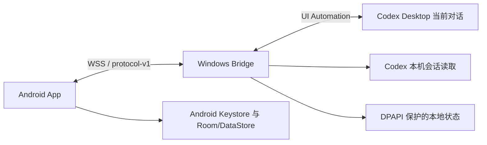

# Codex Micro v1.0.1 架构

## 设计目标

Codex Micro 把 Android 手机变成当前 Codex Desktop 对话的局域网控制器。v1.0.1 的运行时由一个 Android App 和一个 Windows WPF Bridge 组成，不启动独立 Codex App Server 子进程，也不创建另一套不可见任务。

## 组件

### Android App

- Kotlin、Jetpack Compose Material 3 和单向状态流。
- 扫描或手动录入 60 秒配对信息，固定服务器证书 SHA-256 SPKI。
- 在 Android Keystore 中生成不可导出的 P-256 设备签名密钥。
- 维护一个已认证 WSS 连接，按 epoch/seq 顺序应用快照和事件；出现断档时重连并重新取快照。
- 展示当前桌面对话、最近回复、完整历史和审批详情。
- 通过前台服务支持可选的后台与锁屏持续连接。

### Windows Bridge

- .NET 10 WPF 单实例桌面程序和托盘应用。
- 在选定 RFC1918 局域网地址上提供 `/v1/mobile` WSS，并用 mDNS 作为不可信发现提示。
- 管理一次性配对、设备公钥、连接挑战、写操作幂等、事件顺序和本地持久化。
- 使用 Windows UI Automation 定位并重新核验 Codex Desktop 的窗口、输入框、发送/停止控件和审批控件。
- 读取本机 Codex 会话记录，同步手机发送、电脑直接发送和助手完整回复。
- 使用 DPAPI CurrentUser 保护敏感持久化字段；不向手机发送 OpenAI/Codex 凭据。

### 共享协议

`shared/protocol-v1/` 包含业务 envelope、状态码、JSON Schema、fixtures 和无依赖验证器。连接建立后，首个业务事件必须是 snapshot；后续事件只在 epoch 相同且 seq 连续时生效。

所有会改变状态的请求携带稳定 `clientCommandId`。网络超时后重试同一动作必须复用原 ID，Bridge 返回记录结果而不是重复执行；相同 ID 配不同请求体会失败。

## 桌面操作边界

手机发送消息时，Bridge 按以下顺序执行：

1. 找到已核验的 Codex Desktop 进程和当前前台窗口；
2. 定位当前可见 ProseMirror 输入框；
3. 写入完整文本；
4. 重新核验窗口、进程、控件、焦点和输入值；
5. 调用当前输入框关联的发送按钮；
6. 验证输入框已经提交。

任一步骤无法证明目标仍是同一 Codex 对话时，操作失败关闭。实现不依赖固定屏幕坐标，也不会向其他窗口发送无条件全局回车。

审批发现优先于输入框可用性判断，因此 Computer Use 弹窗遮挡输入框时仍能显示待审批状态。执行手机决定前，Bridge 再次核验审批指纹；普通批准只能选择“允许此对话”，拒绝只作用于当前审批。

## 回复和历史同步

Bridge 将 UI 状态和本地 Codex 会话记录合并为一个桌面会话视图。完整回复先写入历史，再更新摘要状态；Android 顶部状态卡只表达运行状态，完整正文位于“最近回复”和历史页，避免同一回复重复展示。

Android 使用 Room 持久化历史，重连快照不会覆盖已经保存的完整长回复。手机发送、电脑直接发送和助手回复都可以出现在历史中。

## 失败与恢复

- 临时网络中断：Android 保留离线状态并指数退避重连；新连接从 snapshot 恢复。
- epoch 变化或 seq 断档：停止应用增量，重新连接，不猜测缺失状态。
- Codex 窗口最小化、切换或控件变化：Bridge 标记桌面同步未就绪，不执行写入。
- 审批已经变化或被其他端解决：手机决定被拒绝，不重复执行。
- 证书 SPKI、设备签名或挑战不匹配：连接硬失败，没有“继续连接”选项。

## 遗留 App Server 资料

`shared/app-server-schema/`、`shared/app-server-compat/` 和 `docs/app-server-compat.md` 保留早期架构研究、生成 Schema 和兼容测试证据。它们不是 v1.0.1 的运行时控制链路。若未来重新采用 App Server，必须建立新的明确版本边界和独立验收，不能把这些遗留资料当作当前能力声明。
